# RAG Hands-On

> A hands-on playground for learning **Retrieval-Augmented Generation (RAG)** and the **text-chunking** strategies that feed it, built with [LangChain](https://python.langchain.com/), [Chroma](https://docs.trychroma.com/), HuggingFace sentence-transformers, and Anthropic's Claude.

## Overview

This repo walks through the full RAG lifecycle one script at a time:

1. **Chunking** — four ways to split raw text into retrievable pieces (character, recursive, semantic, agentic).
2. **Ingestion** — load documents, chunk them, embed them, and store the vectors in Chroma.
3. **Retrieval** — embed a question and pull the most similar chunks back out.
4. **Generation** — feed the retrieved chunks to Claude to answer the question, including a conversational (history-aware) variant.

The goal is to *see* each concept in isolation, then watch them compose into a working RAG pipeline.

A second, more advanced track — [multi_modal_rag.ipynb](multi_modal_rag.ipynb) — applies the same lifecycle to a **real PDF**, keeping its text, tables, and figures and using Claude Opus vision to make the visual content searchable. See [Multimodal RAG over PDFs](#multimodal-rag-over-pdfs-notebook).

## The RAG Pipeline

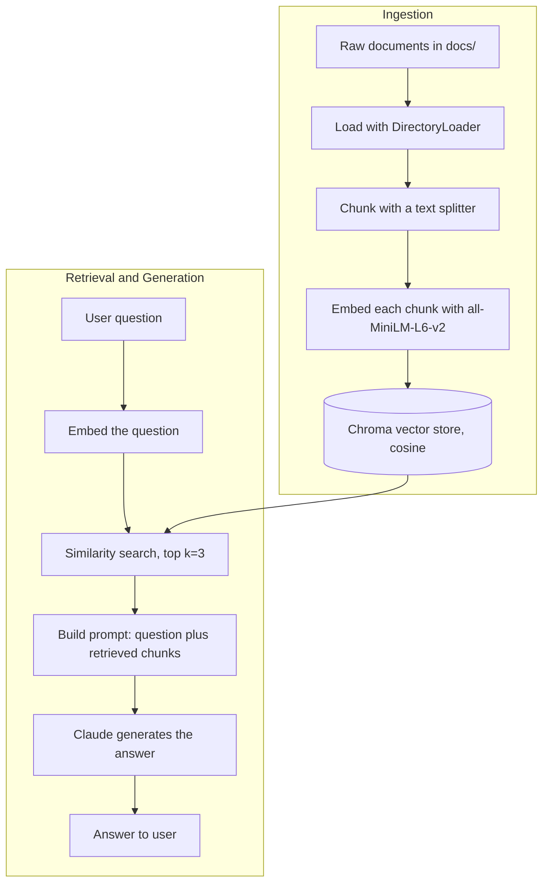

---

## Core Concepts

### 1. Chunking (Text Splitting)

**Definition.** Breaking a long document into smaller pieces ("chunks") before embedding. Chunks are the unit of retrieval — the model retrieves *chunks*, not whole documents.

**Why it matters.** Embedding models and LLMs have limited context windows, and similarity search works best when each chunk covers a single, focused idea. Chunk too big and retrieval is noisy and imprecise; chunk too small and you lose the surrounding context needed to answer.

This project demonstrates four strategies, from simplest to most sophisticated.

---

#### 1a. Character Text Splitting

*Demonstrated in [character_text_splitter.py](character_text_splitter.py) and [ingestion_pipeline.py](ingestion_pipeline.py) (`CharacterTextSplitter`).*

**Definition.** Splits text on a single separator (e.g. `"\n\n"`) and packs the pieces into chunks up to `chunk_size` characters, with an optional `chunk_overlap` between consecutive chunks.

**Advantages**
- Dead simple, fast, and fully deterministic.
- No model calls — zero cost, no latency.
- Predictable chunk sizes.

**Disadvantages**
- Can split mid-sentence or mid-idea if the separator doesn't line up with `chunk_size`.
- A single separator is brittle: if the text doesn't contain `"\n\n"`, it may not split where you expect.
- Ignores meaning entirely — purely mechanical.

---

#### 1b. Recursive Character Text Splitting

*Demonstrated in [character_text_splitter.py](character_text_splitter.py) (`RecursiveCharacterTextSplitter`).*

**Definition.** Tries an ordered list of separators (`["\n\n", "\n", " ", ""]`) in turn — paragraphs first, then lines, then words, then characters — recursing to a finer separator only when a chunk is still too big. This is the **recommended general-purpose splitter** in LangChain.

> Note: the parameter is `separators` (plural). A common typo is `separator` (singular), which is the argument for the non-recursive `CharacterTextSplitter`.

**Advantages**
- Keeps semantically related text together as much as possible (prefers paragraph and sentence boundaries).
- Robust across different document structures — degrades gracefully to finer separators.
- Still fast and free (no model calls).

**Disadvantages**
- Boundaries are still based on punctuation/whitespace, not actual meaning.
- Tuning `chunk_size` / `chunk_overlap` per document type still requires some trial and error.

---

#### 1c. Semantic Chunking

*Demonstrated in [character_text_splitter.py](character_text_splitter.py) (`SemanticChunker`).*

**Definition.** Embeds sentences and splits where the **embedding distance** between adjacent sentences spikes — i.e. where the topic shifts. The breakpoint is decided by a threshold (e.g. `percentile`, here ~70th percentile of distances).

> Note: the threshold parameters are `breakpoint_threshold_type` and `breakpoint_threshold_amount`. Watch for the `threshold` spelling.

**Advantages**
- Chunk boundaries follow *meaning*, not just formatting — each chunk tends to be one coherent topic.
- Adapts to the content instead of forcing a fixed character count.

**Disadvantages**
- Requires an embedding model call per sentence — slower and more expensive than character splitting.
- Chunk sizes become unpredictable (can be very large or very small).
- Sensitive to the threshold setting; needs tuning.

---

#### 1d. Agentic Chunking

*Demonstrated in [agentic_chunking.py](agentic_chunking.py).*

**Definition.** Hands the raw text to an **LLM** and asks it to decide the split points, returning the text with marker tokens (here `<<<SPLIT>>>`) inserted at logical boundaries. The code then splits on those markers and cleans up the pieces.

**Advantages**
- Most "human-like" boundaries — the model understands topic structure, headings, and intent.
- Can follow custom rules ("keep related info together", "~200 chars per chunk", etc.) expressed in natural language.

**Disadvantages**
- Slowest and most expensive — a full LLM call per document.
- Non-deterministic: the same input can chunk differently across runs.
- The model may ignore instructions, drop text, or place markers inconsistently — output needs validation.

---

### 2. Embeddings

*Used throughout via `HuggingFaceEmbeddings("sentence-transformers/all-MiniLM-L6-v2")`.*

**Definition.** A function that converts text into a fixed-length vector of numbers, where semantically similar texts land close together in vector space.

**Advantages**
- Lets you measure "similarity" mathematically (e.g. cosine distance).
- `all-MiniLM-L6-v2` runs locally — free, private, no API calls.

**Disadvantages**
- Smaller local models are less accurate than large hosted embedding models.
- Quality of retrieval is capped by quality of the embedding model.
- Domain-specific jargon may embed poorly without a fine-tuned model.

---

### 3. Vector Store (Chroma)

*Set up in [ingestion_pipeline.py](ingestion_pipeline.py), queried in [retrieval_pipeline.py](retrieval_pipeline.py).*

**Definition.** A database that stores embeddings and supports fast **nearest-neighbor search**. This project uses Chroma with cosine distance (`collection_metadata={"hnsw:space": "cosine"}`), persisted to `db/chroma_db`.

**Advantages**
- Purpose-built for similarity search at scale (uses an HNSW index).
- Persists to disk, so you embed once and query many times.
- Simple LangChain integration (`Chroma.from_documents`, `db.as_retriever`).

**Disadvantages**
- Another piece of infrastructure to manage and keep in sync with source docs.
- If documents change, the store must be re-ingested.
- Local/embedded Chroma isn't built for very large, high-concurrency production loads without extra setup.

---

### 4. Retrieval

*Demonstrated in [retrieval_pipeline.py](retrieval_pipeline.py).*

**Definition.** Embedding the user's query and pulling back the top-`k` most similar chunks (here `k=3`). Optionally a score threshold can filter out weak matches.

**Advantages**
- Grounds the LLM in your *own* data instead of its training memory.
- Cheap and fast compared to re-running the LLM over the whole corpus.

**Disadvantages**
- "Garbage in, garbage out" — if chunking or embeddings are poor, retrieval returns irrelevant context.
- Fixed `k` can retrieve too little (missing context) or too much (noise).
- Pure similarity search can miss results that are relevant but worded differently (no keyword/hybrid search here).

---

### 5. Retrieval-Augmented Generation (RAG)

*Demonstrated in [retrieval_pipeline.py](retrieval_pipeline.py).*

**Definition.** The end-to-end pattern: retrieve relevant chunks, stuff them into the prompt as context, and ask the LLM to answer **using only that context**. The prompt explicitly tells Claude to say "I don't know" if the answer isn't in the documents.

**Advantages**
- Answers are grounded in source documents, reducing hallucination.
- Knowledge can be updated by re-ingesting docs — no model retraining.
- Can cite or trace which chunks informed the answer.

**Disadvantages**
- Answer quality depends entirely on retrieval quality.
- Context windows limit how many chunks you can include.
- Adds latency and moving parts (embed → search → generate) versus a plain LLM call.

---

### 6. History-Aware / Conversational RAG

*Demonstrated in [history_aware_generation.py](history_aware_generation.py).*

**Definition.** A RAG variant that handles multi-turn chat. Before retrieving, it uses the LLM to **rewrite a follow-up question into a standalone, searchable query** using the conversation history (so "What about its revenue?" becomes "What was NVIDIA's 2023 revenue?"). It then retrieves and answers with both the docs and the chat history in context.

**Advantages**
- Handles pronouns and follow-ups naturally ("it", "that", "the same company").
- Produces better retrieval for conversational interfaces than feeding the raw follow-up.

**Disadvantages**
- Extra LLM call to rewrite the query — more latency and cost per turn.
- Query rewriting can drift or misinterpret intent.
- Conversation history grows and must be managed to stay within the context window.

---

## Multimodal RAG over PDFs (Notebook)

*Demonstrated in [multi_modal_rag.ipynb](multi_modal_rag.ipynb).*

The text-only scripts above ingest `.txt` files. The notebook goes a step further: it ingests a **real PDF** — the *Attention Is All You Need* paper ([attention-is-all-you-need.pdf](attention-is-all-you-need.pdf)) — and keeps its **text, tables, and figures** as first-class content. Tables are preserved as HTML and figures are captioned by **Claude Opus 4.8's vision**, so a question like *"According to Table 1, what are the advantages of self-attention layers?"* can be answered from content that isn't plain prose.

Where the `.py` pipeline uses LangChain splitters, the notebook uses [`unstructured`](https://docs.unstructured.io/) to partition the PDF into typed elements, then Claude's vision model to turn mixed (text + table + image) chunks into searchable summaries *before* embedding. Embeddings here are local `BAAI/bge-small-en-v1.5` (384-dim) rather than `all-MiniLM-L6-v2`.

### The Multimodal Pipeline

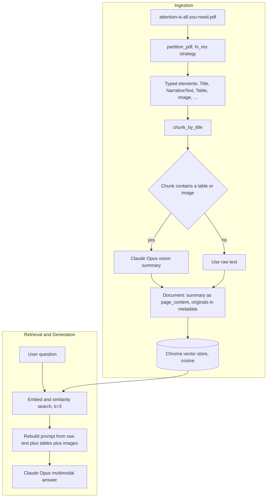

### Core Concepts (multimodal)

#### 7. PDF Partitioning (`unstructured`)

*Demonstrated by `partition_document` in the notebook (`partition_pdf`).*

**Definition.** Parsing a PDF into a list of **typed elements** (`Title`, `NarrativeText`, `Table`, `Image`, `Formula`, `Footer`, …) instead of one flat blob of text. The notebook uses `strategy="hi_res"` with `infer_table_structure=True` (tables become structured HTML) and `extract_image_block_to_payload=True` (figures come back as base64).

**Advantages**
- Preserves document structure — headings, tables, and figures stay distinct and addressable.
- Tables survive as HTML instead of collapsing into jumbled text, so cell relationships are kept.
- Images are extracted inline as base64, ready to feed to a vision model.

**Disadvantages**
- `hi_res` runs OCR and layout detection — slow, and needs native deps (`poppler`, `tesseract`, `libmagic`, `libheif`).
- Quality depends on the PDF; scanned or oddly-laid-out documents partition worse.
- Heavier install footprint than a plain text splitter.

#### 8. Title-Based Chunking

*Demonstrated by `create_chunks_by_title` (`chunk_by_title`).*

**Definition.** Groups consecutive elements into chunks that break at **section titles**, respecting size bounds (`max_characters=3000`, `new_after_n_chars=2400`, `combine_text_under_n_chars=500`). Each chunk keeps its source elements in `metadata.orig_elements`, so the original tables and images travel with it.

**Advantages**
- Boundaries follow the document's own section structure, not a blind character count.
- Tiny fragments (captions, footers) get merged into their neighbours.
- Original elements are retained per chunk, so downstream code can recover tables/images.

**Disadvantages**
- Only as good as the detected titles — a PDF with poor heading structure chunks poorly.
- Still needs size tuning per document type.

#### 9. Vision-Enhanced (Multimodal) Summaries

*Demonstrated by `separate_content_types` + `create_ai_enhanced_summary` + `summarise_chunks`.*

**Definition.** For any chunk that contains a table or image, the raw text + table HTML + base64 images are sent to **Claude Opus 4.8** (a vision model), which writes a dense, *searchable description* of the content. That summary becomes the chunk's `page_content` (what gets embedded), while the originals are stashed in `metadata.original_content` for answer-time. Text-only chunks skip the LLM and embed their raw text.

**Advantages**
- Figures and tables become searchable text — a diagram of the Transformer architecture can now match a query.
- Embedding a rich summary improves retrieval recall over embedding raw extracted text.
- Original content is preserved separately, so the final answer still sees the *real* tables/images, not just the summary.

**Disadvantages**
- A vision LLM call per mixed chunk — the slowest, most expensive stage.
- Summaries can omit or distort details; retrieval quality now depends on summary quality.
- Non-deterministic, like any LLM step.

#### 10. Multimodal Answer Generation

*Demonstrated by `generate_final_answer`.*

**Definition.** At answer time, the retrieved chunks are unpacked from `metadata.original_content` and the prompt is rebuilt from the **original** raw text + table HTML + base64 images (not the summaries). Claude Opus receives a single multimodal message — text plus inline images — and answers using all of it.

**Advantages**
- The model reasons over the actual tables and figures, not a lossy text summary of them.
- Answers can cite specific tables/figures (e.g. "According to Table 1, …").

**Disadvantages**
- Stuffing base64 images into the prompt consumes many tokens.
- Bounded by the context window — only `k=3` chunks of multimodal content fit comfortably.

### Code Walkthrough

The cells below run in order; each screenshot is the actual output from a run over the *Attention Is All You Need* PDF.

**1. Setup — model, embeddings, smoke test.** Load Claude Opus 4.8 (vision-capable, `max_tokens=4096`) and the local `bge-small-en-v1.5` embeddings, then verify both respond.

```python
llm = ChatAnthropic(model="claude-opus-4-8", max_tokens=4096)
embeddings = HuggingFaceEmbeddings(model_name="BAAI/bge-small-en-v1.5")
print(llm.invoke("Reply with the single word: ready").content)
print("embedding dim:", len(embeddings.embed_query("hello")))
```

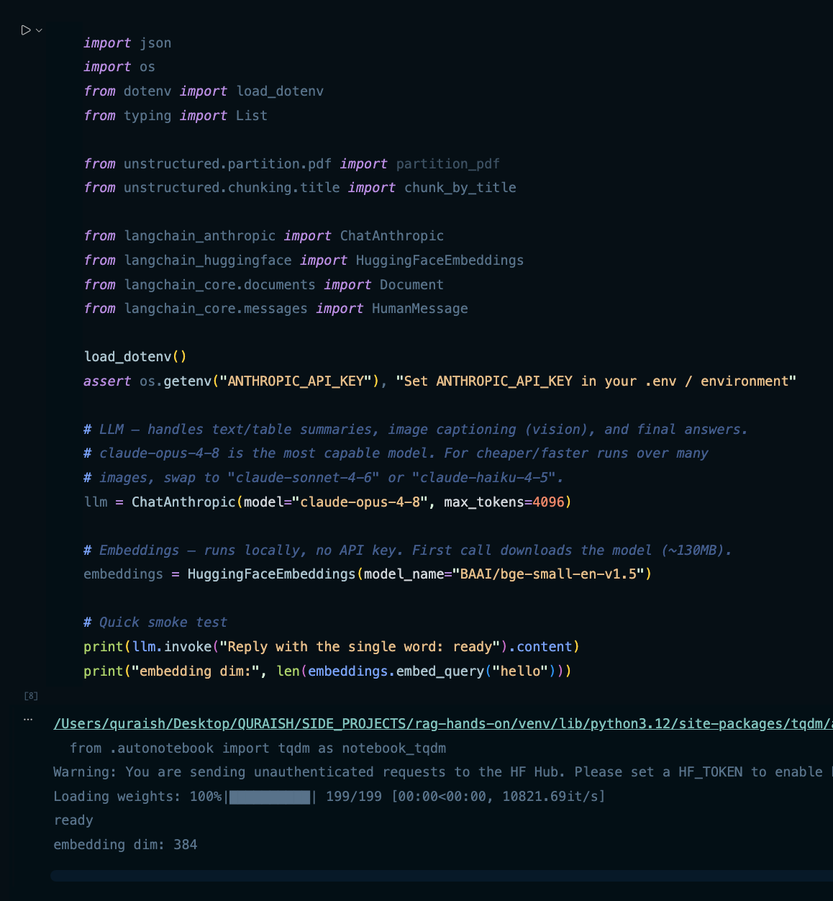

**2. Partition the PDF into typed elements.** `partition_pdf` with `hi_res` extracts text, tables (as HTML), and images (as base64) in one pass.

```python
elements = partition_pdf(
    filename=file_path,
    strategy="hi_res",
    infer_table_structure=True,
    extract_image_block_types=["Image"],
    extract_image_block_to_payload=True,
)
```

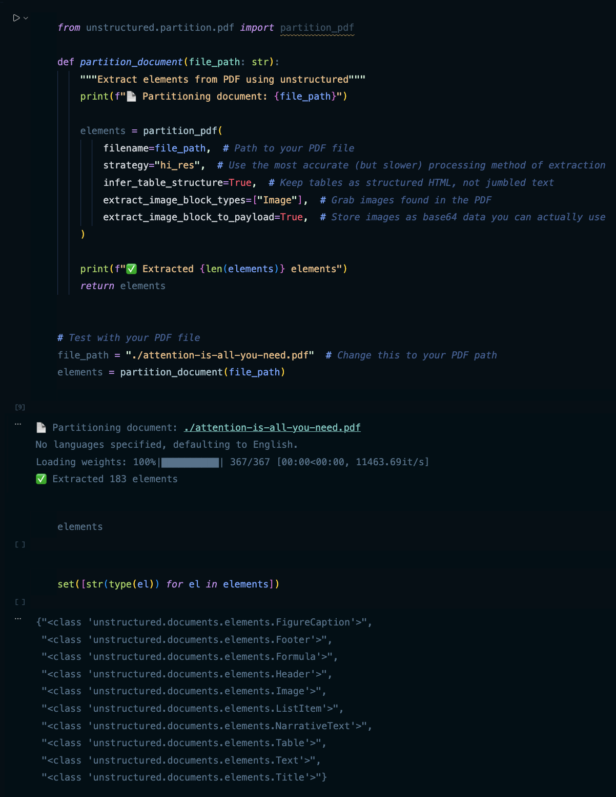

**3. Inspect elements and images.** Each element carries a category and rich metadata; image elements expose `metadata.image_base64`.

```python
images = [element for element in elements if element.category == "Image"]
print(f"Found {len(images)} images in the document.")
images[0].to_dict()
```

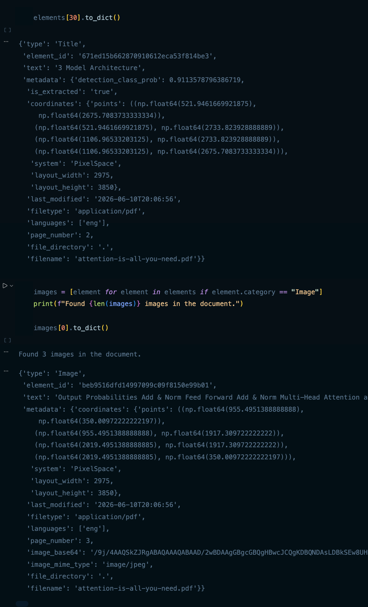

**4. Chunk by title.** Group elements into section-aware chunks; originals stay on `metadata.orig_elements`.

```python
chunks = chunk_by_title(
    elements,
    max_characters=3000,
    new_after_n_chars=2400,
    combine_text_under_n_chars=500,
)
```

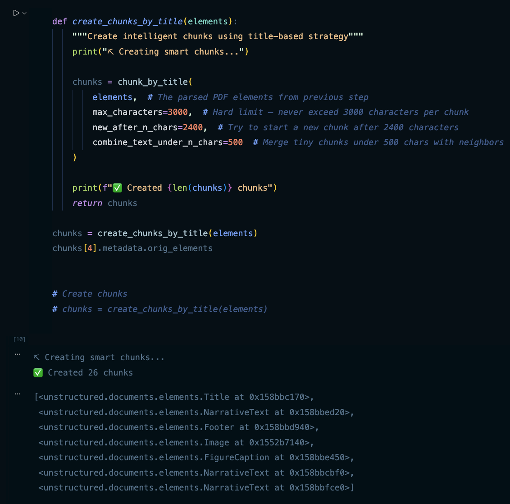

**5. Separate content types, then summarise.** `separate_content_types` splits each chunk into text / tables / images; `create_ai_enhanced_summary` sends mixed chunks (with images attached as `image_url` data URIs) to Claude vision; `summarise_chunks` wraps the result in a `Document` whose metadata holds the originals.

```python
content_data = {"text": chunk.text, "tables": [], "images": [], "types": ["text"]}
# ... pull Table HTML and Image base64 out of chunk.metadata.orig_elements ...

message_content = [{"type": "text", "text": prompt_text}]
for image_base64 in images:
    message_content.append({
        "type": "image_url",
        "image_url": {"url": f"data:image/jpeg;base64,{image_base64}"},
    })
response = llm.invoke([HumanMessage(content=message_content)])
```

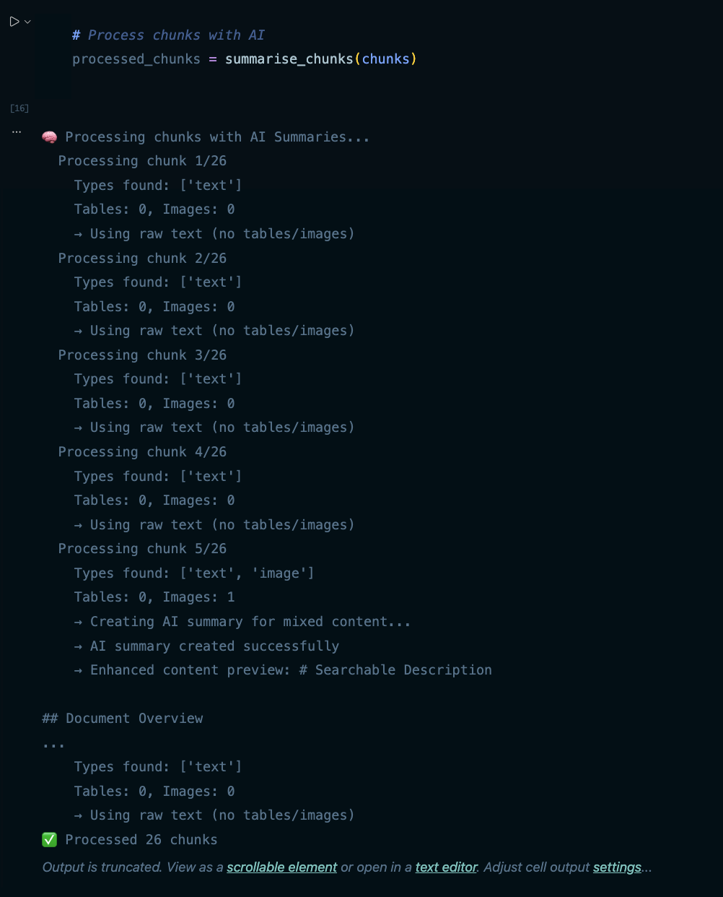

**6. Embed and store in Chroma.** The summaries are embedded with `bge-small` and persisted with cosine distance.

```python
vectorstore = Chroma.from_documents(
    documents=documents,
    embedding=embeddings,
    persist_directory=persist_directory,
    collection_metadata={"hnsw:space": "cosine"},
)
```

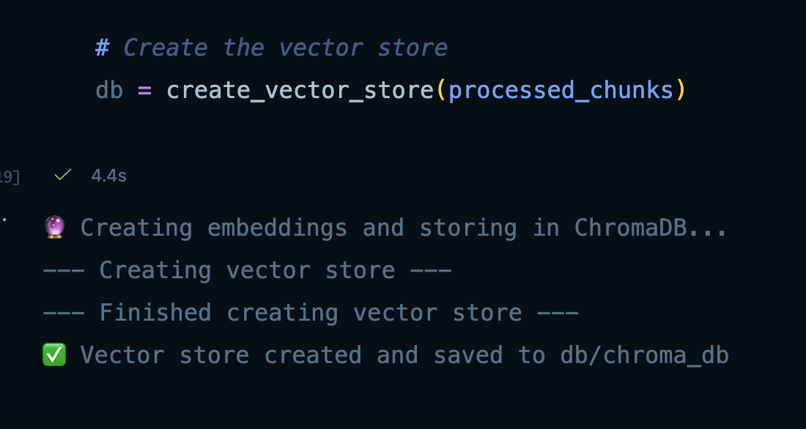

**7. Retrieve.** Embed the question and pull the top `k=3` chunks; here the export is written to `rag_results.json`.

```python
query = "According to Table 1, what are the main advantages of self-attention layers compared to recurrent layers?"
retriever = db.as_retriever(search_kwargs={"k": 3})
chunks = retriever.invoke(query)
export_chunks_to_json(chunks, "rag_results.json")
```

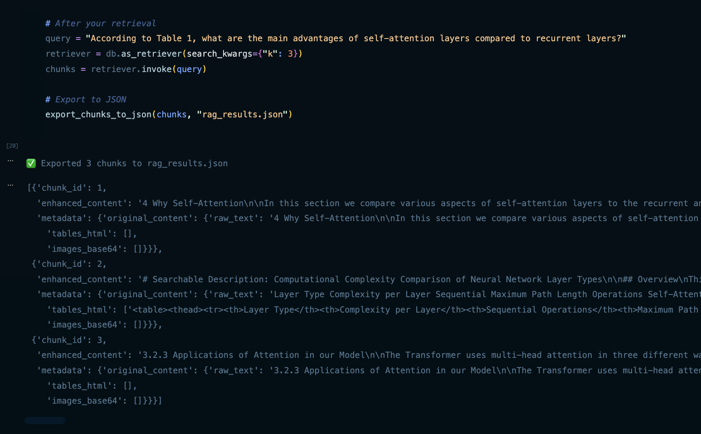

**8. Run the whole pipeline end-to-end.** `run_complete_ingestion_pipeline` chains partition → chunk → summarise → store (into `dbv2/chroma_db`).

```python
def run_complete_ingestion_pipeline(pdf_path: str):
    elements = partition_document(pdf_path)
    chunks = create_chunks_by_title(elements)
    summarised_chunks = summarise_chunks(chunks)
    db = create_vector_store(summarised_chunks, persist_directory="dbv2/chroma_db")
    return db
```

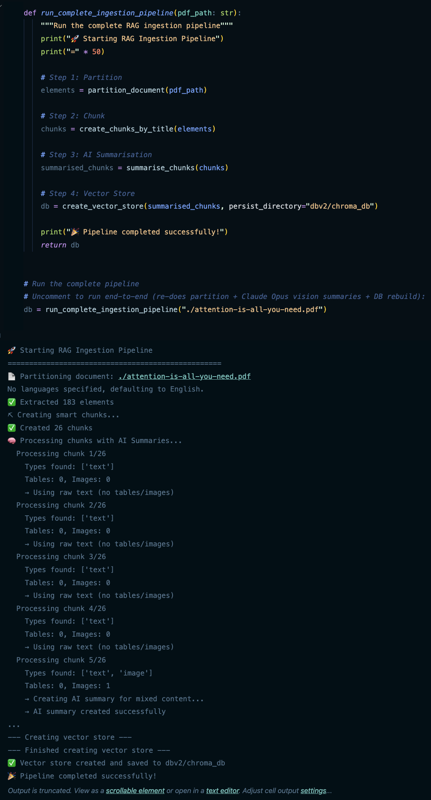

**9. Generate the multimodal answer.** The retrieved chunks are unpacked back into raw text + table HTML + images and sent to Claude, which answers using all modalities.

```python
final_answer = generate_final_answer(chunks, query)
print(final_answer)
```

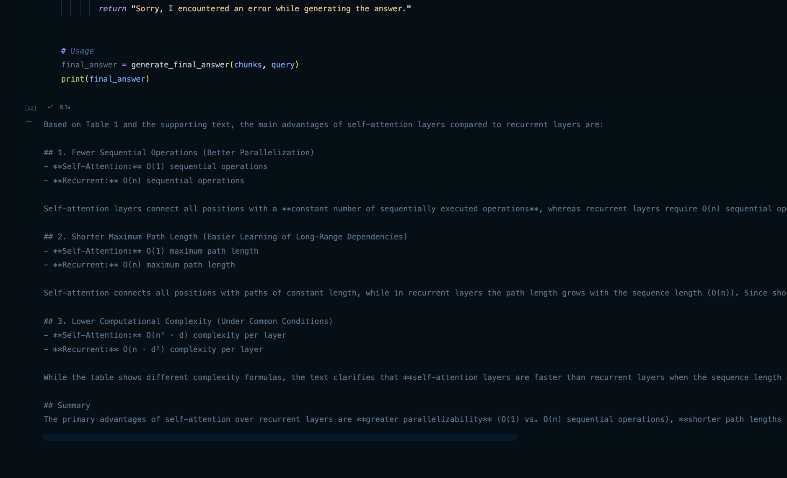

### Notebook Function Reference

| Symbol | Purpose |
| --- | --- |
| `partition_document(file_path)` | Run `partition_pdf` (`hi_res`) and return the list of typed elements (text, tables as HTML, images as base64). |
| `create_chunks_by_title(elements)` | Group elements into section-aware chunks via `chunk_by_title`, preserving originals in `orig_elements`. |
| `separate_content_types(chunk)` | Split one chunk into `text`, `tables`, `images`, and the set of content `types`. |
| `create_ai_enhanced_summary(text, tables, images)` | Ask Claude Opus (vision) for a searchable description of a mixed-content chunk; falls back to a text snippet on error. |
| `summarise_chunks(chunks)` | Summarise every chunk and wrap each as a LangChain `Document` (summary as `page_content`, originals in metadata). |
| `export_chunks_to_json(chunks, filename)` | Dump processed chunks (enhanced content + original content) to JSON. |
| `create_vector_store(documents, persist_directory)` | Embed documents with `bge-small` and persist a cosine Chroma store. |
| `run_complete_ingestion_pipeline(pdf_path)` | Orchestrate partition → chunk → summarise → store end-to-end. |
| `generate_final_answer(chunks, query)` | Rebuild a multimodal prompt from the chunks' original content and have Claude answer. |

---

## File / Script Reference

| File | Concept demonstrated | Run with |
| --- | --- | --- |
| [character_text_splitter.py](character_text_splitter.py) | Character, recursive, and semantic chunking side by side | `python character_text_splitter.py` |
| [agentic_chunking.py](agentic_chunking.py) | LLM-driven (agentic) chunking with Claude | `python agentic_chunking.py` |
| [ingestion_pipeline.py](ingestion_pipeline.py) | Load → chunk → embed → store in Chroma | `python ingestion_pipeline.py` |
| [retrieval_pipeline.py](retrieval_pipeline.py) | Similarity search + RAG answer generation | `python retrieval_pipeline.py` |
| [history_aware_generation.py](history_aware_generation.py) | Conversational RAG with query rewriting | `python history_aware_generation.py` |
| [multi_modal_rag.ipynb](multi_modal_rag.ipynb) | Multimodal RAG over a PDF (text + tables + images) with Claude Opus vision | Open in Jupyter / VS Code |
| `semantic_chunking.py`, `answer_generation.py` | Placeholder / scratch files (currently empty) | — |
| `docs/` | Source documents (`google.txt`, `nvidia.txt`) used for ingestion | — |
| [attention-is-all-you-need.pdf](attention-is-all-you-need.pdf) | Source PDF ingested by the multimodal notebook | — |
| `outputs/` | Screenshots of the notebook's cell outputs (used in this README) | — |
| `db/chroma_db/`, `dbv2/chroma_db/` | Persisted Chroma vector stores (created by ingestion; gitignored) | — |

**Suggested order:** run `ingestion_pipeline.py` first (it builds the vector store), then `retrieval_pipeline.py` and `history_aware_generation.py`. The chunking scripts are standalone and can be run any time.

---

## Setup & Run

```bash
# 1. Create and activate a virtual environment
python -m venv venv
source venv/bin/activate          # Windows: venv\Scripts\activate

# 2. Install dependencies
pip install langchain langchain-anthropic langchain-chroma \
            langchain-huggingface langchain-community \
            langchain-text-splitters chromadb \
            sentence-transformers python-dotenv

# 3. Add your Anthropic API key
cp .env.example .env
# then edit .env and set:
#   ANTHROPIC_API_KEY=sk-ant-...

# 4. Build the vector store from docs/
python ingestion_pipeline.py

# 5. Ask questions against it
python retrieval_pipeline.py
python history_aware_generation.py
```

The embedding model (`all-MiniLM-L6-v2`) downloads automatically on first run and runs locally. Only the generation/agentic-chunking steps call the Anthropic API.

---

## Glossary

- **RAG (Retrieval-Augmented Generation)** — answering a question by first retrieving relevant documents, then having an LLM generate the answer from them.
- **Chunk** — a small slice of a document; the unit that gets embedded and retrieved.
- **Chunk size** — the maximum length (in characters here) of a chunk.
- **Chunk overlap** — characters repeated between consecutive chunks so context isn't lost at the boundary.
- **Separator** — the string a splitter cuts on (e.g. `"\n\n"` for paragraphs).
- **Embedding** — a numeric vector representing the meaning of a piece of text.
- **Vector store** — a database that stores embeddings and finds the nearest ones to a query.
- **Cosine similarity** — a measure of how close two vectors point in the same direction; used to rank chunk relevance.
- **HNSW** — Hierarchical Navigable Small World, the index algorithm Chroma uses for fast nearest-neighbor search.
- **top-k** — the number of most-similar chunks retrieved per query (here, 3).
- **Retriever** — the object that turns a query into a set of relevant chunks (`db.as_retriever(...)`).
- **Semantic chunking** — splitting where the *meaning* between sentences shifts, detected via embedding distance.
- **Agentic chunking** — letting an LLM decide where to split the text.
- **Query rewriting** — using the LLM to turn a conversational follow-up into a standalone search query.
- **Context window** — the maximum amount of text an LLM can consider in one request.
- **Partitioning** — splitting a PDF into typed elements (titles, paragraphs, tables, images) rather than one flat string.
- **`hi_res` strategy** — `unstructured`'s high-resolution mode that runs OCR + layout detection to recover tables and images accurately.
- **Title-based chunking** — grouping elements into chunks that break at section titles (`chunk_by_title`).
- **Multimodal / vision summary** — a searchable text description of a chunk's tables and images, written by a vision LLM and embedded in place of (a copy of) the raw content.
- **Base64 image payload** — an image encoded as text so it can be embedded in JSON metadata and passed inline to a vision model.
- **Multimodal RAG** — RAG where retrieved context and the final prompt include images and tables, not just text.
