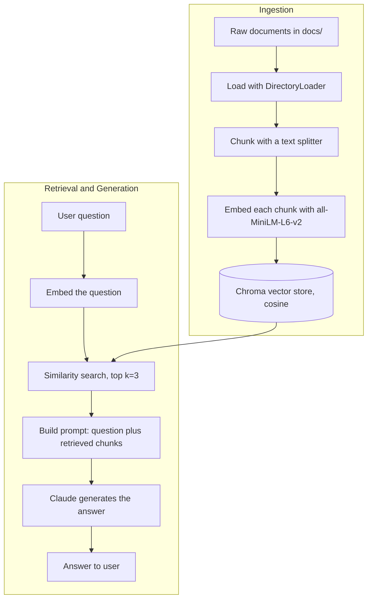

# Chapter 2 — The RAG Pipeline

> Part of the [RAG Hands-On handbook](../README.md#the-handbook). You have chunks from [Chapter 1](01-chunking.md); now turn them into a searchable store and answer questions against it.

Once text is chunked, a RAG pipeline has two halves: **ingestion** (load → chunk → embed → store) and **retrieval + generation** (embed the question → search → prompt the LLM). The text-only track builds the store in [ingestion_pipeline.py](../ingestion_pipeline.py) and queries it in [retrieval_pipeline.py](../retrieval_pipeline.py).



---

## Embeddings

*Used throughout via `HuggingFaceEmbeddings("sentence-transformers/all-MiniLM-L6-v2")`.*

**Definition.** A function that converts text into a fixed-length vector of numbers, where semantically similar texts land close together in vector space.

**Advantages**
- Lets you measure "similarity" mathematically (e.g. cosine distance).
- `all-MiniLM-L6-v2` runs locally — free, private, no API calls.

**Disadvantages**
- Smaller local models are less accurate than large hosted embedding models.
- Quality of retrieval is capped by quality of the embedding model.
- Domain-specific jargon may embed poorly without a fine-tuned model.

---

## Vector Store (Chroma)

*Set up in [ingestion_pipeline.py](../ingestion_pipeline.py), queried in [retrieval_pipeline.py](../retrieval_pipeline.py).*

**Definition.** A database that stores embeddings and supports fast **nearest-neighbor search**. This project uses Chroma with cosine distance (`collection_metadata={"hnsw:space": "cosine"}`), persisted to `db/chroma_db`.

**Advantages**
- Purpose-built for similarity search at scale (uses an HNSW index).
- Persists to disk, so you embed once and query many times.
- Simple LangChain integration (`Chroma.from_documents`, `db.as_retriever`).

**Disadvantages**
- Another piece of infrastructure to manage and keep in sync with source docs.
- If documents change, the store must be re-ingested.
- Local/embedded Chroma isn't built for very large, high-concurrency production loads without extra setup.

---

## Retrieval

*Demonstrated in [retrieval_pipeline.py](../retrieval_pipeline.py).*

**Definition.** Embedding the user's query and pulling back the top-`k` most similar chunks (here `k=3`). Optionally a score threshold can filter out weak matches.

**Advantages**
- Grounds the LLM in your *own* data instead of its training memory.
- Cheap and fast compared to re-running the LLM over the whole corpus.

**Disadvantages**
- "Garbage in, garbage out" — if chunking or embeddings are poor, retrieval returns irrelevant context.
- Fixed `k` can retrieve too little (missing context) or too much (noise).
- Pure similarity search can miss results that are relevant but worded differently (no keyword/hybrid search here).

---

## Retrieval-Augmented Generation (RAG)

*Demonstrated in [retrieval_pipeline.py](../retrieval_pipeline.py).*

**Definition.** The end-to-end pattern: retrieve relevant chunks, stuff them into the prompt as context, and ask the LLM to answer **using only that context**. The prompt explicitly tells Claude to say "I don't know" if the answer isn't in the documents.

**Advantages**
- Answers are grounded in source documents, reducing hallucination.
- Knowledge can be updated by re-ingesting docs — no model retraining.
- Can cite or trace which chunks informed the answer.

**Disadvantages**
- Answer quality depends entirely on retrieval quality.
- Context windows limit how many chunks you can include.
- Adds latency and moving parts (embed → search → generate) versus a plain LLM call.

---

## Code Walkthrough

### `ingestion_pipeline.py` — load → chunk → embed → store

`main()` calls three functions in order; each is one stage of the ingestion half of the diagram above.

**1. Load.** Read every `*.txt` under `docs/` as LangChain `Document`s.

```python
def load_documents(docs_path="docs"):
    ...
    loader = DirectoryLoader(docs_path, glob="*.txt", loader_cls=TextLoader)
    documents = loader.load()
    ...
    return documents
```

Here that's `google.txt` and `nvidia.txt`.

**2. Chunk.** Character-split each document into ≤800-char pieces.

```python
def split_documents(documents, chunk_size=800, chunk_overlap=0):
    text_splitter = CharacterTextSplitter(
        chunk_size=chunk_size, chunk_overlap=chunk_overlap
    )
    chunks = text_splitter.split_documents(documents)
    ...
    return chunks
```

This is strategy 1a from [Chapter 1](01-chunking.md), now applied to real documents instead of a toy string.

**3. Embed + store.** Turn each chunk into a vector and persist it in Chroma.

```python
def create_embeddings(chunks, persist_directory="db/chroma_db"):
    embedding_model = HuggingFaceEmbeddings(
        model_name="sentence-transformers/all-MiniLM-L6-v2"
    )
    vector_store = Chroma.from_documents(
        documents=chunks,
        embedding=embedding_model,
        persist_directory=persist_directory,
        collection_metadata={"hnsw:space": "cosine"},
    )
    return vector_store
```

The `embedding_model` is the bridge between text and the vector store — the same model must be reused at query time so questions and chunks land in the same vector space. The store is written to disk at `db/chroma_db` with cosine distance.

**4. Orchestrate.** `main()` just chains the three stages.

```python
def main():
    documents = load_documents(docs_path="docs")
    chunks = split_documents(documents)
    vector_store = create_embeddings(chunks)
```

### `retrieval_pipeline.py` — query → retrieve → prompt → answer

This script runs at module level (no functions) and is the retrieval-and-generation half of the diagram.

**1. Reopen the store.** Reconnect to the same `db/chroma_db`, with the same embedding model.

```python
db = Chroma(
    persist_directory=persist_directory,
    embedding_function=embedding_model,
    collection_metadata={"hnsw:space": "cosine"},
)
```

**2. Retrieve.** Embed the question and pull the 3 nearest chunks.

```python
query = "What happened to NVIDIA in 2023?"
retriever = db.as_retriever(search_kwargs={"k": 3})
relevant_docs = retriever.invoke(query)
```

A commented-out alternative in the file swaps in a `similarity_score_threshold` retriever that *also* drops weak matches below a score.

**3. Build the grounded prompt.** Stuff the retrieved chunks into the prompt and constrain the answer to them.

```python
combined_input = f"""Based on the following retrieved documents, answer the question: {query}

Documents:
{chr(10).join([doc.page_content for doc in relevant_docs])}
Please provide a concise answer based on the above documents. If you cant find the answer in the documents, say you don't know.
"""
```

The "say you don't know" instruction is what keeps RAG grounded — it tells Claude not to fall back on training memory.

**4. Generate.** Send a system + human message pair and print the answer.

```python
model = ChatAnthropic(model="claude-haiku-4-5")
messages = [
    SystemMessage(content="You are a helpful assistant that answers questions based on the provided documents."),
    HumanMessage(content=combined_input),
]
result = model.invoke(messages)
print(f"Answer: {result.content}")
```

---

[← Chapter 1 — Chunking](01-chunking.md) · [Handbook contents](../README.md#the-handbook) · [Next: Chapter 3 — Conversational RAG →](03-conversational-rag.md)
