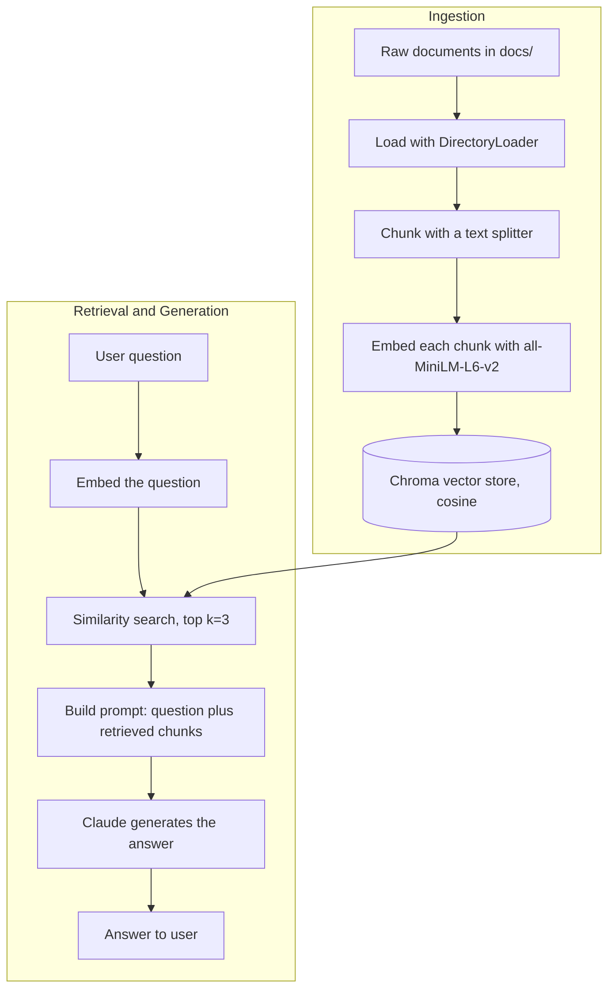

# Chapter 2 — The RAG Pipeline

> Part of the [RAG Hands-On handbook](../README.md#the-handbook). You have chunks from [Chapter 1](01-chunking.md); now turn them into a searchable store and answer questions against it.

Once text is chunked, a RAG pipeline has two halves: **ingestion** (load → chunk → embed → store) and **retrieval + generation** (embed the question → search → prompt the LLM). The text-only track builds the store in [ingestion_pipeline.py](../ingestion_pipeline.py) and queries it in [retrieval_pipeline.py](../retrieval_pipeline.py).

---

## Embeddings

*Used throughout via `HuggingFaceEmbeddings("sentence-transformers/all-MiniLM-L6-v2")`.*

**Definition.** A function that converts text into a fixed-length vector of numbers, where semantically similar texts land close together in vector space.

**Advantages**
- Lets you measure "similarity" mathematically (e.g. cosine distance).
- `all-MiniLM-L6-v2` runs locally — free, private, no API calls.

**Disadvantages**
- Smaller local models are less accurate than large hosted embedding models.
- Quality of retrieval is capped by quality of the embedding model.
- Domain-specific jargon may embed poorly without a fine-tuned model.

---

## Vector Store (Chroma)

*Set up in [ingestion_pipeline.py](../ingestion_pipeline.py), queried in [retrieval_pipeline.py](../retrieval_pipeline.py).*

**Definition.** A database that stores embeddings and supports fast **nearest-neighbor search**. This project uses Chroma with cosine distance (`collection_metadata={"hnsw:space": "cosine"}`), persisted to `db/chroma_db`.

**Advantages**
- Purpose-built for similarity search at scale (uses an HNSW index).
- Persists to disk, so you embed once and query many times.
- Simple LangChain integration (`Chroma.from_documents`, `db.as_retriever`).

**Disadvantages**
- Another piece of infrastructure to manage and keep in sync with source docs.
- If documents change, the store must be re-ingested.
- Local/embedded Chroma isn't built for very large, high-concurrency production loads without extra setup.

---

## Retrieval

*Demonstrated in [retrieval_pipeline.py](../retrieval_pipeline.py).*

**Definition.** Embedding the user's query and pulling back the top-`k` most similar chunks (here `k=3`). Optionally a score threshold can filter out weak matches.

**Advantages**
- Grounds the LLM in your *own* data instead of its training memory.
- Cheap and fast compared to re-running the LLM over the whole corpus.

**Disadvantages**
- "Garbage in, garbage out" — if chunking or embeddings are poor, retrieval returns irrelevant context.
- Fixed `k` can retrieve too little (missing context) or too much (noise).
- Pure similarity search can miss results that are relevant but worded differently (no keyword/hybrid search here).

---

## Retrieval-Augmented Generation (RAG)

*Demonstrated in [retrieval_pipeline.py](../retrieval_pipeline.py).*

**Definition.** The end-to-end pattern: retrieve relevant chunks, stuff them into the prompt as context, and ask the LLM to answer **using only that context**. The prompt explicitly tells Claude to say "I don't know" if the answer isn't in the documents.

**Advantages**
- Answers are grounded in source documents, reducing hallucination.
- Knowledge can be updated by re-ingesting docs — no model retraining.
- Can cite or trace which chunks informed the answer.

**Disadvantages**
- Answer quality depends entirely on retrieval quality.
- Context windows limit how many chunks you can include.
- Adds latency and moving parts (embed → search → generate) versus a plain LLM call.

---

[← Chapter 1 — Chunking](01-chunking.md) · [Handbook contents](../README.md#the-handbook) · [Next: Chapter 3 — Conversational RAG →](03-conversational-rag.md)
