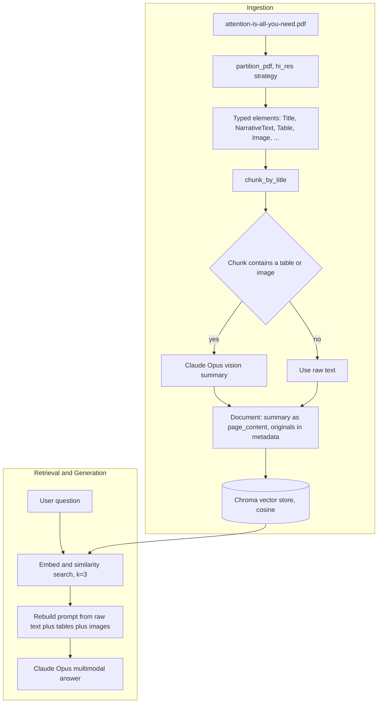

# Chapter 4 — Multimodal RAG over PDFs

> Part of the [RAG Hands-On handbook](../README.md#the-handbook). The capstone chapter — everything from Chapters 1–3, now over a real PDF with text, tables, and figures.

*Demonstrated in [multi_modal_rag.ipynb](../multi_modal_rag.ipynb).*

The text-only scripts in the earlier chapters ingest `.txt` files. The notebook goes a step further: it ingests a **real PDF** — the *Attention Is All You Need* paper ([attention-is-all-you-need.pdf](../attention-is-all-you-need.pdf)) — and keeps its **text, tables, and figures** as first-class content. Tables are preserved as HTML and figures are captioned by **Claude Opus 4.8's vision**, so a question like *"According to Table 1, what are the advantages of self-attention layers?"* can be answered from content that isn't plain prose.

Where the `.py` pipeline uses LangChain splitters, the notebook uses [`unstructured`](https://docs.unstructured.io/) to partition the PDF into typed elements, then Claude's vision model to turn mixed (text + table + image) chunks into searchable summaries *before* embedding. Embeddings here are local `BAAI/bge-small-en-v1.5` (384-dim) rather than `all-MiniLM-L6-v2`.

## The Multimodal Pipeline



## Core Concepts

### PDF Partitioning (`unstructured`)

*Demonstrated by `partition_document` in the notebook (`partition_pdf`).*

**Definition.** Parsing a PDF into a list of **typed elements** (`Title`, `NarrativeText`, `Table`, `Image`, `Formula`, `Footer`, …) instead of one flat blob of text. The notebook uses `strategy="hi_res"` with `infer_table_structure=True` (tables become structured HTML) and `extract_image_block_to_payload=True` (figures come back as base64).

**Advantages**
- Preserves document structure — headings, tables, and figures stay distinct and addressable.
- Tables survive as HTML instead of collapsing into jumbled text, so cell relationships are kept.
- Images are extracted inline as base64, ready to feed to a vision model.

**Disadvantages**
- `hi_res` runs OCR and layout detection — slow, and needs native deps (`poppler`, `tesseract`, `libmagic`, `libheif`).
- Quality depends on the PDF; scanned or oddly-laid-out documents partition worse.
- Heavier install footprint than a plain text splitter.

### Title-Based Chunking

*Demonstrated by `create_chunks_by_title` (`chunk_by_title`).*

**Definition.** Groups consecutive elements into chunks that break at **section titles**, respecting size bounds (`max_characters=3000`, `new_after_n_chars=2400`, `combine_text_under_n_chars=500`). Each chunk keeps its source elements in `metadata.orig_elements`, so the original tables and images travel with it.

**Advantages**
- Boundaries follow the document's own section structure, not a blind character count.
- Tiny fragments (captions, footers) get merged into their neighbours.
- Original elements are retained per chunk, so downstream code can recover tables/images.

**Disadvantages**
- Only as good as the detected titles — a PDF with poor heading structure chunks poorly.
- Still needs size tuning per document type.

### Vision-Enhanced (Multimodal) Summaries

*Demonstrated by `separate_content_types` + `create_ai_enhanced_summary` + `summarise_chunks`.*

**Definition.** For any chunk that contains a table or image, the raw text + table HTML + base64 images are sent to **Claude Opus 4.8** (a vision model), which writes a dense, *searchable description* of the content. That summary becomes the chunk's `page_content` (what gets embedded), while the originals are stashed in `metadata.original_content` for answer-time. Text-only chunks skip the LLM and embed their raw text.

**Advantages**
- Figures and tables become searchable text — a diagram of the Transformer architecture can now match a query.
- Embedding a rich summary improves retrieval recall over embedding raw extracted text.
- Original content is preserved separately, so the final answer still sees the *real* tables/images, not just the summary.

**Disadvantages**
- A vision LLM call per mixed chunk — the slowest, most expensive stage.
- Summaries can omit or distort details; retrieval quality now depends on summary quality.
- Non-deterministic, like any LLM step.

### Multimodal Answer Generation

*Demonstrated by `generate_final_answer`.*

**Definition.** At answer time, the retrieved chunks are unpacked from `metadata.original_content` and the prompt is rebuilt from the **original** raw text + table HTML + base64 images (not the summaries). Claude Opus receives a single multimodal message — text plus inline images — and answers using all of it.

**Advantages**
- The model reasons over the actual tables and figures, not a lossy text summary of them.
- Answers can cite specific tables/figures (e.g. "According to Table 1, …").

**Disadvantages**
- Stuffing base64 images into the prompt consumes many tokens.
- Bounded by the context window — only `k=3` chunks of multimodal content fit comfortably.

## Code Walkthrough

The cells below run in order; each screenshot is the actual output from a run over the *Attention Is All You Need* PDF.

**1. Setup — model, embeddings, smoke test.** Load Claude Opus 4.8 (vision-capable, `max_tokens=4096`) and the local `bge-small-en-v1.5` embeddings, then verify both respond.

```python
llm = ChatAnthropic(model="claude-opus-4-8", max_tokens=4096)
embeddings = HuggingFaceEmbeddings(model_name="BAAI/bge-small-en-v1.5")
print(llm.invoke("Reply with the single word: ready").content)
print("embedding dim:", len(embeddings.embed_query("hello")))
```


**2. Partition the PDF into typed elements.** `partition_pdf` with `hi_res` extracts text, tables (as HTML), and images (as base64) in one pass.

```python
elements = partition_pdf(
    filename=file_path,
    strategy="hi_res",
    infer_table_structure=True,
    extract_image_block_types=["Image"],
    extract_image_block_to_payload=True,
)
```


**3. Inspect elements and images.** Each element carries a category and rich metadata; image elements expose `metadata.image_base64`.

```python
images = [element for element in elements if element.category == "Image"]
print(f"Found {len(images)} images in the document.")
images[0].to_dict()
```


**4. Chunk by title.** Group elements into section-aware chunks; originals stay on `metadata.orig_elements`.

```python
chunks = chunk_by_title(
    elements,
    max_characters=3000,
    new_after_n_chars=2400,
    combine_text_under_n_chars=500,
)
```


**5. Separate content types, then summarise.** `separate_content_types` splits each chunk into text / tables / images; `create_ai_enhanced_summary` sends mixed chunks (with images attached as `image_url` data URIs) to Claude vision; `summarise_chunks` wraps the result in a `Document` whose metadata holds the originals.

```python
content_data = {"text": chunk.text, "tables": [], "images": [], "types": ["text"]}
# ... pull Table HTML and Image base64 out of chunk.metadata.orig_elements ...

message_content = [{"type": "text", "text": prompt_text}]
for image_base64 in images:
    message_content.append({
        "type": "image_url",
        "image_url": {"url": f"data:image/jpeg;base64,{image_base64}"},
    })
response = llm.invoke([HumanMessage(content=message_content)])
```


**6. Embed and store in Chroma.** The summaries are embedded with `bge-small` and persisted with cosine distance.

```python
vectorstore = Chroma.from_documents(
    documents=documents,
    embedding=embeddings,
    persist_directory=persist_directory,
    collection_metadata={"hnsw:space": "cosine"},
)
```


**7. Retrieve.** Embed the question and pull the top `k=3` chunks; here the export is written to `rag_results.json`.

```python
query = "According to Table 1, what are the main advantages of self-attention layers compared to recurrent layers?"
retriever = db.as_retriever(search_kwargs={"k": 3})
chunks = retriever.invoke(query)
export_chunks_to_json(chunks, "rag_results.json")
```


**8. Run the whole pipeline end-to-end.** `run_complete_ingestion_pipeline` chains partition → chunk → summarise → store (into `dbv2/chroma_db`).

```python
def run_complete_ingestion_pipeline(pdf_path: str):
    elements = partition_document(pdf_path)
    chunks = create_chunks_by_title(elements)
    summarised_chunks = summarise_chunks(chunks)
    db = create_vector_store(summarised_chunks, persist_directory="dbv2/chroma_db")
    return db
```


**9. Generate the multimodal answer.** The retrieved chunks are unpacked back into raw text + table HTML + images and sent to Claude, which answers using all modalities.

```python
final_answer = generate_final_answer(chunks, query)
print(final_answer)
```


## Notebook Function Reference

| Symbol | Purpose |
| --- | --- |
| `partition_document(file_path)` | Run `partition_pdf` (`hi_res`) and return the list of typed elements (text, tables as HTML, images as base64). |
| `create_chunks_by_title(elements)` | Group elements into section-aware chunks via `chunk_by_title`, preserving originals in `orig_elements`. |
| `separate_content_types(chunk)` | Split one chunk into `text`, `tables`, `images`, and the set of content `types`. |
| `create_ai_enhanced_summary(text, tables, images)` | Ask Claude Opus (vision) for a searchable description of a mixed-content chunk; falls back to a text snippet on error. |
| `summarise_chunks(chunks)` | Summarise every chunk and wrap each as a LangChain `Document` (summary as `page_content`, originals in metadata). |
| `export_chunks_to_json(chunks, filename)` | Dump processed chunks (enhanced content + original content) to JSON. |
| `create_vector_store(documents, persist_directory)` | Embed documents with `bge-small` and persist a cosine Chroma store. |
| `run_complete_ingestion_pipeline(pdf_path)` | Orchestrate partition → chunk → summarise → store end-to-end. |
| `generate_final_answer(chunks, query)` | Rebuild a multimodal prompt from the chunks' original content and have Claude answer. |

---

[← Chapter 3 — Conversational RAG](03-conversational-rag.md) · [Handbook contents](../README.md#the-handbook) · [Next: Chapter 5 — Advanced Retrieval →](05-advanced-retrieval.md)
