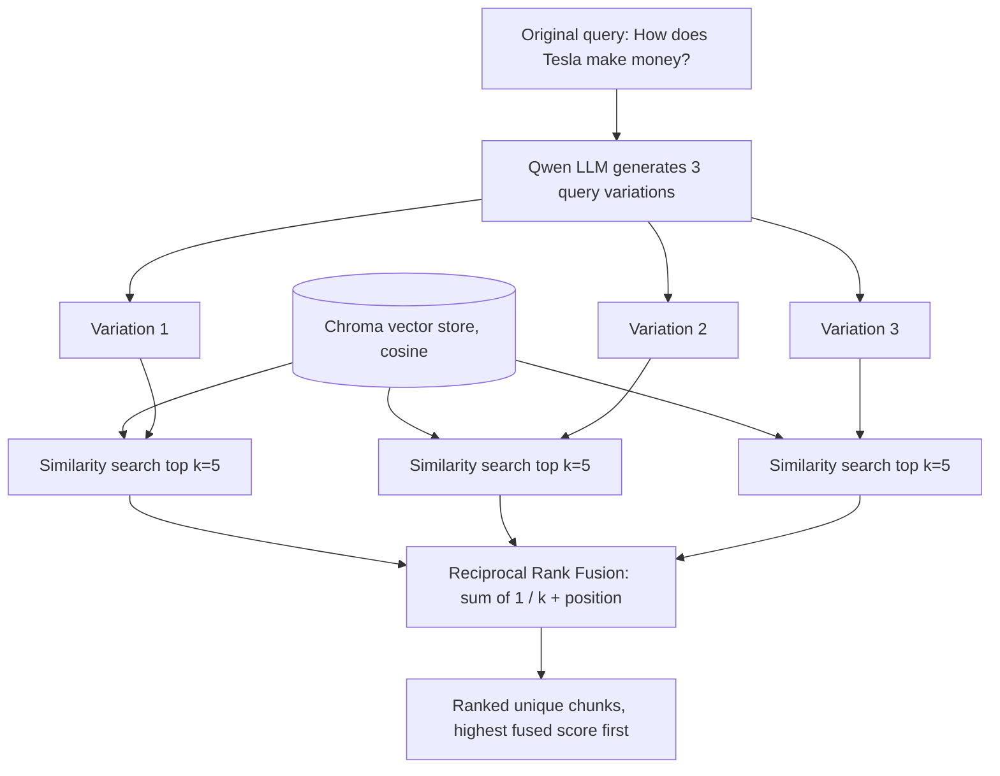
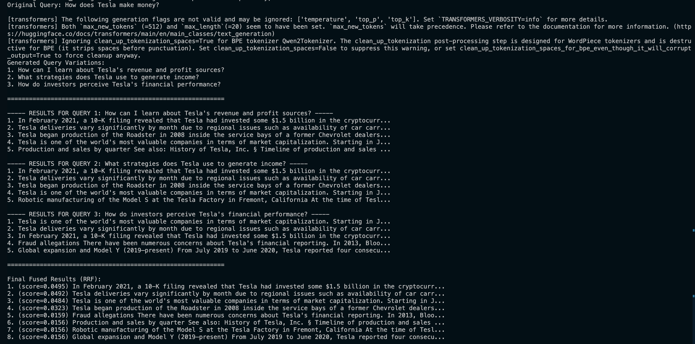
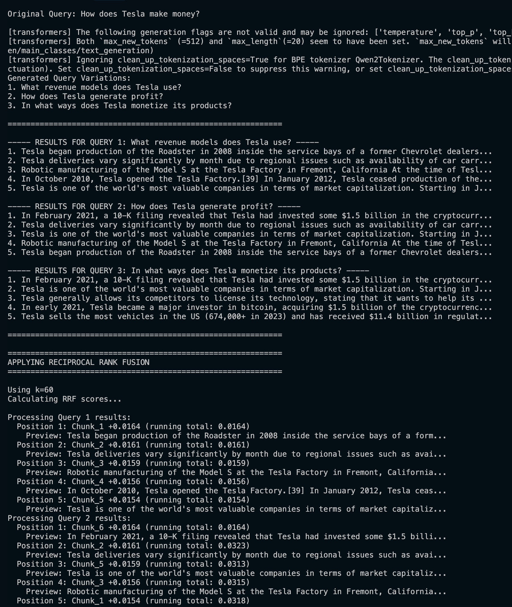
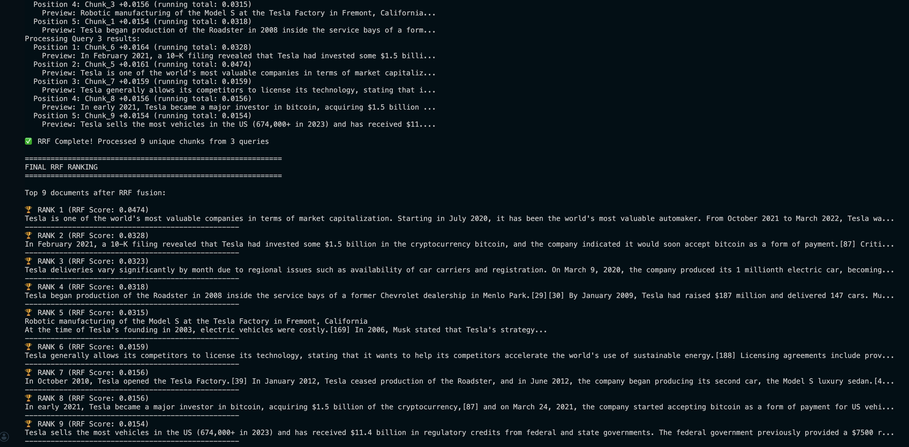

# Chapter 5 — Advanced Retrieval

> Part of the [RAG Hands-On handbook](../README.md#the-handbook). [Chapter 2](02-rag-pipeline.md) retrieved with a single similarity search; this chapter improves *what comes back* before it ever reaches the LLM.

Plain top-`k` similarity search has two weaknesses: it can return near-duplicates (wasting context-window space), and it only finds chunks worded like the question. This chapter covers three fixes, building on a new Tesla corpus added to the store:

- **Retrieval search types** ([retrieval_methods.py](../retrieval_methods.py)) — similarity, score threshold, and MMR, side by side.
- **Multi-query retrieval + RRF** ([multi_query_retrieval.py](../multi_query_retrieval.py)) — rephrase the question several ways, search each, and fuse the result lists.
- **A verbose RRF walkthrough** ([reciprocal_rank_fusion.py](../reciprocal_rank_fusion.py)) — the same fusion with every score printed so you can see how it ranks.



---

## Similarity Score Threshold

*Demonstrated as Method 2 in [retrieval_methods.py](../retrieval_methods.py).*

**Definition.** A retriever (`search_type="similarity_score_threshold"`) that returns the top-`k` chunks **but drops any whose similarity score falls below a cutoff** (here `0.3`). The result set can come back smaller than `k` — or empty.

**Advantages**
- Filters out weak, off-topic matches instead of always returning a fixed `k`.
- For an out-of-corpus question, it can correctly return nothing rather than forcing irrelevant chunks.

**Disadvantages**
- The threshold is a magic number — too high returns nothing, too low changes nothing.
- A good threshold depends on the embedding model and the distance metric, so it needs tuning per setup.

---

## Max Marginal Relevance (MMR)

*Demonstrated as Method 3 in [retrieval_methods.py](../retrieval_methods.py).*

**Definition.** A retriever (`search_type="mmr"`) that first fetches a larger candidate pool (`fetch_k=20`), then picks `k` results that are each relevant to the query **but also different from the ones already chosen**. The `lambda_mult` knob trades off relevance vs. diversity (0 = max diversity, 1 = max relevance; here `0.5`).

**Advantages**
- Avoids returning three near-duplicate chunks that all say the same thing.
- Covers more distinct facets of the answer within the same `k` budget.

**Disadvantages**
- Slower: it fetches `fetch_k` candidates and re-ranks them.
- Too much diversity (`lambda_mult` low) can surface loosely-related chunks.

---

## Multi-Query Retrieval

*Demonstrated in [multi_query_retrieval.py](../multi_query_retrieval.py).*

**Definition.** Use an LLM to rephrase the original question into several variations, run a separate similarity search for each, and combine the results. One phrasing might match chunks the others miss.

**Advantages**
- Recovers relevant chunks worded differently from the original question.
- Cheap recall boost — only the rephrasing step calls the LLM; searches are local.

**Disadvantages**
- More searches = more latency and more candidate chunks to fuse.
- Depends on the LLM producing genuinely different, sensible rephrasings.

---

## Reciprocal Rank Fusion (RRF)

*Demonstrated in [multi_query_retrieval.py](../multi_query_retrieval.py) (compact) and [reciprocal_rank_fusion.py](../reciprocal_rank_fusion.py) (verbose).*

**Definition.** A way to merge several ranked result lists into one. Each chunk earns `1 / (k + position)` for every list it appears in (here `k=60`, `position` is its rank in that list), and the scores are summed. A chunk that ranks well across *multiple* queries floats to the top.

**Advantages**
- Rewards chunks that multiple query variations agree on — a strong relevance signal.
- Rank-based, so it needs no calibrated similarity scores across lists; the constant `k` damps the influence of any single top-1 result.

**Disadvantages**
- The fused score is relative, not an absolute relevance measure.
- `k` is another tunable; a chunk found by only one query still gets a (small) score.

---

## Code Walkthrough

The four scripts run in this order: ingest the new corpus, explore retrieval types, then multi-query + RRF (compact, then verbose).

### `ingest_tesla.py` — add one document to the existing store

A one-off that appends `docs/tesla.txt` to the Chroma collection already built in [Chapter 2](02-rag-pipeline.md), *without* re-ingesting `google.txt` / `nvidia.txt`.

```python
documents = TextLoader("docs/tesla.txt").load()
chunks = CharacterTextSplitter(chunk_size=800, chunk_overlap=0).split_documents(
    documents
)
print(f"tesla.txt -> {len(chunks)} chunks")
```

Same 800-char character splitting as the original pipeline, so the new chunks match the existing ones.

```python
db = Chroma(
    persist_directory=persist_directory,
    embedding_function=embedding_model,
    collection_metadata={"hnsw:space": "cosine"},
)

db.add_documents(chunks)
print(f"Added {len(chunks)} Tesla chunks. Collection size: {db._collection.count()}")
```

`db.add_documents` embeds and inserts into the live collection — the queries in the rest of the chapter are about Tesla, so the corpus has to contain it first.

### `retrieval_methods.py` — three search types, same query

Runs at module level. After reopening the store, it runs the *same* query three ways. Method 1 is the plain similarity search from Chapter 2:

```python
print("=== METHOD 1: Similarity Search (k=3) ===")
retriever = db.as_retriever(search_kwargs={"k": 3})
docs = retriever.invoke(query)
```

Method 2 adds a score floor — note `search_type` and the extra `score_threshold` kwarg:

```python
retriever = db.as_retriever(
    search_type="similarity_score_threshold",
    search_kwargs={
        "k": 3,
        "score_threshold": 0.3,  # Only return docs with similarity >= 0.3
    },
)
```

Method 3 switches to MMR, which fetches a wider pool and re-ranks for diversity:

```python
retriever = db.as_retriever(
    search_type="mmr",
    search_kwargs={
        "k": 3,
        "fetch_k": 20,  # Number of docs to fetch before re-ranking for diversity
        "lambda_mult": 0.5,  # 0 = max diversity, 1 = max relevance
    },
)
```

The only thing that changes between methods is the retriever configuration — the `.invoke(query)` / print loop is identical, which is the point: same query, different retrieval behavior.

### `multi_query_retrieval.py` — generate variations, search each, fuse

**1. Generate query variations.** HuggingFace text-generation endpoints don't support function-calling structured output, so the script steers the model with a JSON shape and parses it with a Pydantic parser. Note `return_full_text: False` in the pipeline — without it the echoed prompt (including the schema) ends up in the output and the parser grabs that instead of the answer.

```python
parser = PydanticOutputParser(pydantic_object=QueryVariations)

prompt = f"""Generate 3 different variations of this query that would help retrieve relevant documents:

Original query: {original_query}

Return 3 alternative queries that rephrase or approach the same question from different angles.

Respond with ONLY a JSON object containing the actual queries. Do not repeat the schema.
The output must match this exact shape, with your own queries filled in:

{{"queries": ["first rephrased query", "second rephrased query", "third rephrased query"]}}"""

response = parser.invoke(llm.invoke(prompt))
query_variations = response.queries
```

**2. Search with each variation.** Each variation gets its own top-`k=5` search; all result lists are collected for fusion.

```python
retriever = db.as_retriever(search_kwargs={"k": 5})  # Get more docs for better RRF
all_retrieval_results = []  # Store all results for RRF

for i, query in enumerate(query_variations, 1):
    docs = retriever.invoke(query)
    all_retrieval_results.append(docs)
```

**3. Fuse with RRF (compact).** Every chunk accumulates `1 / (rank + k)` across the lists it appears in, keyed by its content; then sort by the summed score.

```python
k = 60  # RRF constant
fused_scores = {}
doc_lookup = {}

for docs in all_retrieval_results:
    for rank, doc in enumerate(docs):
        doc_id = doc.page_content
        doc_lookup[doc_id] = doc
        fused_scores[doc_id] = fused_scores.get(doc_id, 0) + 1 / (rank + k)

reranked = sorted(fused_scores.items(), key=lambda x: x[1], reverse=True)
```

The output shows the three generated variations, each query's top-5, and the final fused ranking — chunks that appeared for multiple variations rank highest:



### `reciprocal_rank_fusion.py` — the same fusion, fully traced

Steps 1 and 2 are identical to the script above (generate variations, search each). The difference is Step 3: RRF lives in a `reciprocal_rank_fusion()` function that prints every score so the ranking is auditable.

**1. Accumulate scores, position by position.** For each chunk it assigns a stable `Chunk_N` id (for readable logs), computes `1 / (k + position)`, and adds it to a running `defaultdict(float)` total.

```python
for query_idx, chunks in enumerate(chunk_lists, 1):
    for position, chunk in enumerate(chunks, 1):  # position is 1-indexed
        chunk_content = chunk.page_content

        if chunk_content not in chunk_id_map:
            chunk_id_map[chunk_content] = f"Chunk_{chunk_counter}"
            chunk_counter += 1

        all_unique_chunks[chunk_content] = chunk
        position_score = 1 / (k + position)
        rrf_scores[chunk_content] += position_score
```

The verbose log makes the "running total" visible — a chunk seen in query 1 and again in query 2 has its score climb the second time:



**2. Sort and return.** Map each surviving chunk back to its `Document` object and sort by fused score, highest first.

```python
sorted_chunks = sorted(
    [
        (all_unique_chunks[chunk_content], score)
        for chunk_content, score in rrf_scores.items()
    ],
    key=lambda x: x[1],  # Sort by RRF score
    reverse=True,  # Highest scores first
)
return sorted_chunks
```

**3. Display the final ranking.** Step 4 prints the top-10 fused documents with their scores.

```python
for rank, (doc, rrf_score) in enumerate(fused_results[:10], 1):
    print(f"🏆 RANK {rank} (RRF Score: {rrf_score:.4f})")
    print(f"{doc.page_content[:200]}...")
```

The top entries are the chunks several query variations agreed on, so their scores roughly double those found by a single query:



---

## API Reference

| Symbol | File | Purpose |
| --- | --- | --- |
| `db.as_retriever(search_type="similarity_score_threshold", search_kwargs={...})` | [retrieval_methods.py](../retrieval_methods.py) | Top-`k` retrieval that drops matches below `score_threshold`. |
| `db.as_retriever(search_type="mmr", search_kwargs={...})` | [retrieval_methods.py](../retrieval_methods.py) | Diversity-aware retrieval; `fetch_k` candidates re-ranked into `k` results via `lambda_mult`. |
| `QueryVariations(BaseModel)` | [multi_query_retrieval.py](../multi_query_retrieval.py) | Pydantic schema (`queries: List[str]`) the LLM output is parsed into. |
| `reciprocal_rank_fusion(chunk_lists, k=60, verbose=True)` | [reciprocal_rank_fusion.py](../reciprocal_rank_fusion.py) | Fuse multiple ranked chunk lists into one ranking; returns `[(Document, score), ...]` sorted high-to-low. |
| `db.add_documents(chunks)` | [ingest_tesla.py](../ingest_tesla.py) | Embed and append chunks to an existing Chroma collection. |

---

[← Chapter 4 — Multimodal RAG](04-multimodal-rag.md) · [Handbook contents](../README.md#the-handbook) · [Next: Chapter 6 — Hybrid Search →](06-hybrid-search.md)
