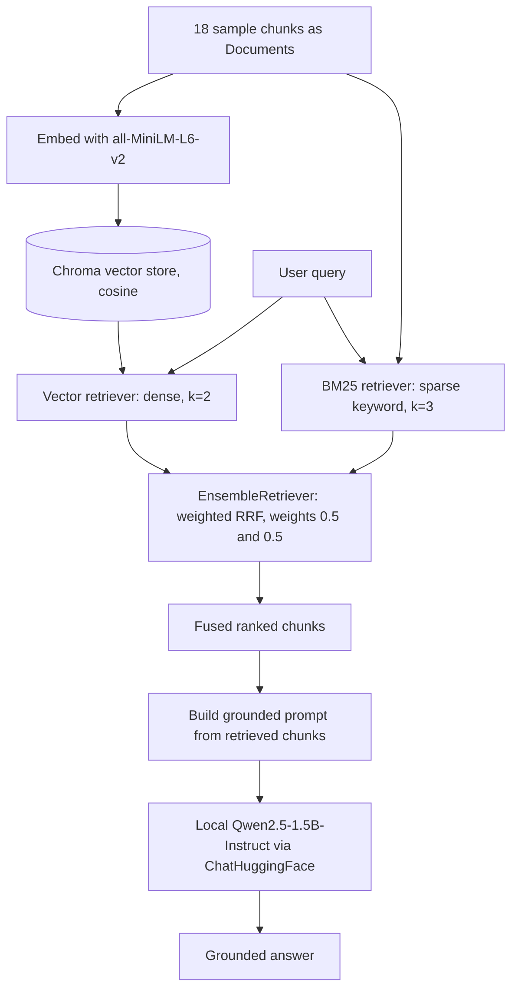
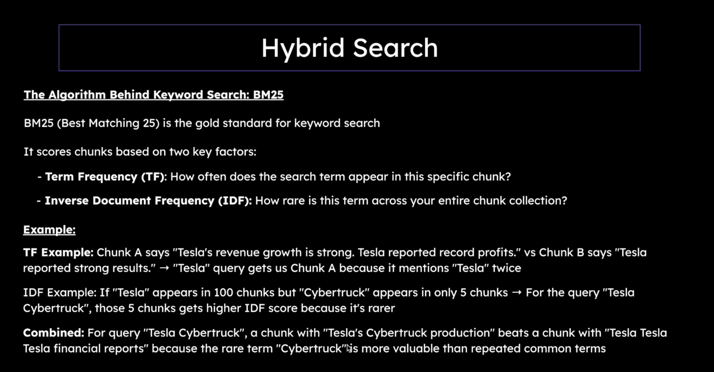
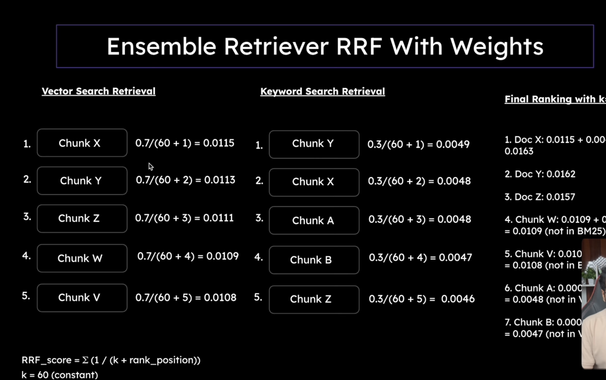

# Chapter 6 — Hybrid Search

> Part of the [RAG Hands-On handbook](../README.md#the-handbook). [Chapter 5](05-advanced-retrieval.md) fused several *dense* result lists with RRF; this chapter fuses a *dense* list with a *sparse* (keyword) one, so semantic and exact-term matches reinforce each other.

Dense vector search is great at meaning but blind to exact tokens — it can miss a literal `"7.5 billion"` or a product name like `"Cybertruck"`. Keyword search (BM25) is the opposite: great at exact terms, blind to paraphrase. **Hybrid search** runs both and fuses the rankings, so a query that mixes a concept with a specific term gets the best of each. The whole pipeline lives in [hybrid_search.ipynb](../hybrid_search.ipynb) and runs entirely locally — no API keys, including a local LLM for the final answer.



---

## Dense vs. Sparse Retrieval

*Both built in [hybrid_search.ipynb](../hybrid_search.ipynb); dense reuses the embeddings from [Chapter 2](02-rag-pipeline.md).*

**Definition.** *Dense* retrieval embeds text into vectors and ranks by cosine similarity — it matches *meaning*. *Sparse* retrieval (BM25) scores by term overlap — it matches *exact words*. Hybrid search uses both at once.

**Advantages**
- Dense finds paraphrases (`"space exploration company"` → *SpaceX*) that share no keywords.
- Sparse nails exact tokens (product names, numbers, IDs) that embeddings blur together.

**Disadvantages**
- Dense can miss a rare literal term; sparse can miss an obvious paraphrase — neither alone is enough.
- Running two retrievers means two indexes to build and keep in sync.

---

## BM25 (Keyword Search)

*`BM25Retriever.from_documents(...)` in [hybrid_search.ipynb](../hybrid_search.ipynb); backed by the `rank_bm25` package.*

**Definition.** BM25 ("Best Matching 25") is the standard keyword-ranking algorithm. It scores a chunk from two signals: **Term Frequency (TF)** — how often the query term appears in *this* chunk — and **Inverse Document Frequency (IDF)** — how rare the term is across the *whole* collection. Rare terms that match are worth more than common ones.



**Advantages**
- No model or embeddings needed — pure lexical scoring, fast and cheap.
- IDF means a rare matching term like `"Cybertruck"` outranks a chunk that just repeats a common word.

**Disadvantages**
- Zero understanding of meaning — `"car"` and `"automobile"` are unrelated to it.
- Sensitive to exact wording; misspellings and synonyms slip through.

---

## EnsembleRetriever + Weighted RRF

*`EnsembleRetriever(retrievers=[...], weights=[...])` in [hybrid_search.ipynb](../hybrid_search.ipynb).*

**Definition.** LangChain's `EnsembleRetriever` fuses the two ranked lists with **weighted Reciprocal Rank Fusion**. Each chunk scores `weight / (k + rank_position)` in every list it appears in (`k=60`), and the per-list scores are summed. The `weights` (here `[0.5, 0.5]`) scale each retriever's contribution before summing, so you can lean the blend toward semantic or keyword matching.



The slide above uses a 0.7 / 0.3 split to make the weighting visible: Chunk X scores `0.7/(60+1)=0.0115` from vectors plus `0.3/(60+2)=0.0048` from keywords = `0.0163`, landing it first because *both* retrievers ranked it highly. Chunks found by only one retriever still score, but lower. The notebook uses an even `0.5 / 0.5` split.

**Advantages**
- Rank-based, so it fuses two scores that aren't on the same scale (cosine vs. BM25) without calibration.
- `weights` give a single dial to tune the dense/sparse balance per use case.

**Disadvantages**
- Another constant (`k`) and the weights to tune.
- A chunk strong in only one list can still be outranked by one that both lists rank modestly — usually desirable, occasionally not.

---

## Code Walkthrough

The notebook runs top to bottom: set up data, build each retriever and test it in isolation, combine them, then answer two mixed queries with a local LLM.

**1. Imports.** Pull the two retrievers from their LangChain 1.x homes (these moved out of `langchain.retrievers`), plus the same local embedding stack as the rest of the handbook.

```python
from langchain_classic.retrievers import EnsembleRetriever
from langchain_community.retrievers import BM25Retriever

from langchain_huggingface import HuggingFaceEmbeddings
from langchain_chroma import Chroma
from langchain_core.documents import Document
from dotenv import load_dotenv

load_dotenv()
```

**2. Install the BM25 backend.** `BM25Retriever` needs the `rank_bm25` package.

```python
%pip install rank_bm25
```

**3. Sample data.** Eighteen short chunks deliberately seeded with ambiguity — repeated `"Tesla"`, python-the-snake vs. python-the-language, java-the-coffee vs. java-the-language — so dense and sparse search visibly disagree.

```python
chunks = [
    "Microsoft acquired GitHub for 7.5 billion dollars in 2018.",
    "Tesla Cybertruck production ramp begins in 2024.",
    ...
    "Orange County reported new housing developments."
]
```

**4. Convert to `Document`s.** LangChain retrievers operate on `Document` objects, not raw strings.

```python
documents = [Document(page_content=chunk, metadata={"source": f"chunk_{i}"}) for i, chunk in enumerate(chunks)]
```

**5. Vector retriever (dense).** Embed the chunks into Chroma and retrieve the top 2 by cosine similarity.

```python
embedding_model = HuggingFaceEmbeddings(model_name="sentence-transformers/all-MiniLM-L6-v2")
vectorstore = Chroma.from_documents(
    documents=documents,
    embedding=embedding_model,
    collection_metadata={"hnsw:space": "cosine"}
)
vector_retriever = vectorstore.as_retriever(search_kwargs={"k": 2})
```

The test query proves the semantic point: `"space exploration company"` returns the *SpaceX* chunk despite sharing no keywords with it.

```python
test_query = "space exploration company"  # works in vector search but wouldn't work with keyword search
test_docs = vector_retriever.invoke(test_query)
```

**6. BM25 retriever (sparse).** Build the keyword index straight from the documents and return the top 3.

```python
bm25_retriever = BM25Retriever.from_documents(documents)
bm25_retriever.k = 3
```

Its test query is the mirror image: `"Tesla"` ranks the keyword-dense `"Tesla Tesla Tesla..."` chunk first, because TF rewards the repetition.

```python
test_query = "Tesla"
test_docs = bm25_retriever.invoke(test_query)
for doc in test_docs[:2]:
    print(f"Found: {doc.page_content}")
```

**7. Hybrid retriever.** Combine the two with equal weight — this is the `EnsembleRetriever` / weighted-RRF step from the concept section above.

```python
hybrid_retriever = EnsembleRetriever(
    retrievers=[vector_retriever, bm25_retriever],
    weights=[0.5, 0.5]  # Equal weight to vector and keyword search
)
```

**8. Query 1 — concept + exact number.** `"purchase cost 7.5 billion"`: the vector side understands "purchase cost", BM25 locks onto the literal `"7.5 billion"`, and the fused ranking surfaces the Microsoft/GitHub chunk that satisfies both.

```python
test_query = "purchase cost 7.5 billion"
retrieved_chunks = hybrid_retriever.invoke(test_query)
for i, doc in enumerate(retrieved_chunks, 1):
    print(f"{i}. {doc.page_content}")
```

**9. Query 2 — concept + product name.** `"electric vehicle manufacturing Cybertruck"`: returns both the exact-keyword *Cybertruck* chunks and the semantically related "electric vehicles... manufacturing plants" chunk.

```python
test_query = "electric vehicle manufacturing Cybertruck"
retrieved_chunks = hybrid_retriever.invoke(test_query)
for i, doc in enumerate(retrieved_chunks, 1):
    print(f"{i}. {doc.page_content}")
```

**10. Generate a grounded answer.** Stuff the fused chunks into a prompt and let a **local** LLM answer using only that context — the same grounding pattern as [Chapter 2](02-rag-pipeline.md), now fed by hybrid retrieval. Running Qwen locally keeps the whole notebook key-free.

```python
from langchain_huggingface import ChatHuggingFace, HuggingFacePipeline

combined_input = f"""Based on the following documents, please answer this question: {test_query}

Documents:
{chr(10).join([f"- {doc.page_content}" for doc in retrieved_chunks])}

Please provide a clear, helpful answer using only the information from these documents. If you can't find the answer in the documents, say so.
"""

model = ChatHuggingFace(
    llm=HuggingFacePipeline.from_model_id(
        model_id="Qwen/Qwen2.5-1.5B-Instruct",
        task="text-generation",
        pipeline_kwargs={"max_new_tokens": 512, "do_sample": False, "return_full_text": False},
    )
)
result = model.invoke([
    SystemMessage(content="You are a helpful assistant."),
    HumanMessage(content=combined_input),
])
print(result.content)
```

---

## Glossary

New terms in this chapter (the shared [glossary](glossary.md) has the full list):

- **Hybrid search** — combining dense (vector) and sparse (keyword) retrieval, then fusing the results.
- **Dense retrieval** — ranking by embedding similarity; matches meaning.
- **Sparse retrieval** — ranking by term overlap; matches exact words.
- **BM25** — the standard keyword-ranking algorithm, scoring on Term Frequency and Inverse Document Frequency.
- **TF (Term Frequency)** — how often a query term appears in a given chunk.
- **IDF (Inverse Document Frequency)** — how rare a term is across the whole collection; rarer matches score higher.
- **EnsembleRetriever** — LangChain retriever that fuses several retrievers' results via weighted RRF.
- **Weighted RRF** — reciprocal rank fusion where each retriever's `1/(k+rank)` contribution is scaled by a weight before summing.

---

## API Reference

| Symbol | Source | Purpose |
| --- | --- | --- |
| `BM25Retriever.from_documents(documents)` | `langchain_community.retrievers` | Build a keyword (sparse) retriever; set `.k` for how many to return. |
| `vectorstore.as_retriever(search_kwargs={"k": 2})` | `langchain_chroma` | Dense retriever over the Chroma store. |
| `EnsembleRetriever(retrievers=[...], weights=[...])` | `langchain_classic.retrievers` | Fuse multiple retrievers with weighted RRF. |
| `ChatHuggingFace(llm=HuggingFacePipeline.from_model_id(...))` | `langchain_huggingface` | Local LLM (Qwen2.5-1.5B-Instruct) for the final grounded answer. |

---

[← Chapter 5 — Advanced Retrieval](05-advanced-retrieval.md) · [Handbook contents](../README.md#the-handbook) · [Next: Chapter 7 — Reranking →](07-reranking.md)
