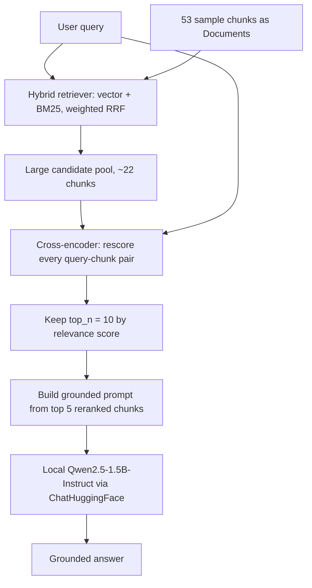

# Chapter 7 — Reranking

> Part of the [RAG Hands-On handbook](../README.md#the-handbook). [Chapter 6](06-hybrid-search.md) fused dense and sparse retrieval into one ranked list; this chapter adds a second, more accurate scoring pass on top of it.

Retrievers are built for speed: they embed every chunk once, ahead of time, and compare vectors at query time (a *bi-encoder*). That's fast but approximate — the query and the chunk never "see" each other during scoring. A **reranker** is the opposite trade-off: it runs the query and each candidate chunk *together* through a model (a *cross-encoder*) to score true relevance, which is far more accurate but too slow to run over a whole corpus. The standard pattern is **two-stage retrieval**: retrieve a large candidate pool cheaply, then rerank that small pool precisely. The pipeline lives in [reranker.ipynb](../reranker.ipynb) and runs entirely locally — no API keys.



---

## Reranking (Two-Stage Retrieval)

*The whole point of [reranker.ipynb](../reranker.ipynb).*

**Definition.** A two-stage pipeline: stage 1 (the hybrid retriever from [Chapter 6](06-hybrid-search.md)) pulls a *large* candidate pool fast; stage 2 (the reranker) rescores just those candidates with a slower, more accurate model and keeps the best `top_n`. The retriever optimizes recall; the reranker optimizes precision at the top.

**Advantages**
- Much better top-k relevance than retrieval alone, at a fraction of the cost of scoring the whole corpus.
- Decouples "find plausibly-relevant chunks" from "rank them precisely" — each stage uses the right tool.

**Disadvantages**
- Adds a second model and extra latency per query.
- Quality is capped by stage 1: a chunk the retriever never surfaces can't be reranked into the answer.

---

## Cross-Encoder vs. Bi-Encoder

*`HuggingFaceCrossEncoder` + `CrossEncoderReranker` in [reranker.ipynb](../reranker.ipynb).*

**Definition.** A *bi-encoder* (the embedding model) encodes the query and each chunk into vectors **separately**, then compares them — chunk vectors can be precomputed and indexed, so it's fast. A *cross-encoder* feeds the query and a chunk into the model **together** as one input and outputs a single relevance score — it can model word-level interaction between them, so it's accurate but must run once per (query, chunk) pair at query time.

**Advantages**
- Judges relevance on the actual query-chunk pair, not two independent embeddings — catches nuance the bi-encoder misses.
- `cross-encoder/ms-marco-MiniLM-L-6-v2` runs locally and is small enough for CPU.

**Disadvantages**
- Cost scales with pool size: scoring N candidates is N model passes — fine for ~20, infeasible for 20,000.
- No precomputation possible, since the score depends on the specific query.

---

## Code Walkthrough

The notebook reuses the hybrid retriever from [Chapter 6](06-hybrid-search.md) (here over a larger 53-chunk dataset with `k=15`), then adds the rerank and generation stages.

**1. Imports.** The Chapter 6 retrieval stack plus the two reranking pieces: `HuggingFaceCrossEncoder` (the model) and `CrossEncoderReranker` (the LangChain compressor that wraps it).

```python
from langchain_classic.retrievers import EnsembleRetriever
from langchain_community.retrievers import BM25Retriever
from langchain_huggingface import HuggingFaceEmbeddings
from langchain_chroma import Chroma
from langchain_core.documents import Document
from langchain_classic.retrievers.document_compressors import CrossEncoderReranker
from langchain_community.cross_encoders import HuggingFaceCrossEncoder
from dotenv import load_dotenv

load_dotenv()
```

**2. Install the cross-encoder backend.** `HuggingFaceCrossEncoder` runs on `sentence-transformers`.

```python
%pip install sentence-transformers
```

**3. Expanded sample data.** 53 chunks across Tesla / Microsoft / NVIDIA / Google plus a block of deliberately "noisy" near-miss chunks — a bigger, messier corpus so reranking has something to fix.

```python
chunks = [
    # Tesla - Financial & Production
    "Tesla reported record quarterly revenue of $25.2 billion in Q3 2024.",
    ...
    # Noisy/Less Relevant Chunks
    "The Tesla coil was invented by Nikola Tesla in 1891.",
    ...
]
print(f"Created {len(chunks)} sample chunks for demonstration")
```

**4. Convert to `Document`s.** Same step as the other notebooks — retrievers operate on `Document` objects.

```python
documents = [Document(page_content=chunk, metadata={"source": f"chunk_{i}"}) for i, chunk in enumerate(chunks)]
```

**5. Build the hybrid retriever.** Identical to [Chapter 6](06-hybrid-search.md), but each retriever returns `k=15` (a *large* pool to feed the reranker) and the ensemble weights vector vs. keyword `0.7 / 0.3`.

```python
embedding_model = HuggingFaceEmbeddings(model_name="sentence-transformers/all-MiniLM-L6-v2")
vectorstore = Chroma.from_documents(documents=documents, embedding=embedding_model,
                                    collection_metadata={"hnsw:space": "cosine"})
vector_retriever = vectorstore.as_retriever(search_kwargs={"k": 15})

bm25_retriever = BM25Retriever.from_documents(documents)
bm25_retriever.k = 15

hybrid_retriever = EnsembleRetriever(
    retrievers=[vector_retriever, bm25_retriever],
    weights=[0.7, 0.3]
)
```

**6. Stage 1 — retrieve the candidate pool.** Run the hybrid search; this is the (larger, noisier) input the reranker will clean up.

```python
query = "Tesla financial performance and production updates"
retrieved_docs = hybrid_retriever.invoke(query)
for i, doc in enumerate(retrieved_docs, 1):
    print(f"{i:2d}. {doc.page_content}")
print(f"\n(Retrieved {len(retrieved_docs)} total chunks for reranking)\n")
```

**7. Stage 2 — rerank.** Load the cross-encoder, wrap it in `CrossEncoderReranker` with `top_n=10`, and call `compress_documents` — which scores every `(query, doc)` pair and returns the 10 highest.

```python
cross_encoder = HuggingFaceCrossEncoder(model_name="cross-encoder/ms-marco-MiniLM-L-6-v2")
reranker = CrossEncoderReranker(model=cross_encoder, top_n=10)
reranked_docs = reranker.compress_documents(retrieved_docs, query)
for i, doc in enumerate(reranked_docs, 1):
    print(f"{i:2d}. {doc.page_content}")
```

The same cell then prints a BEFORE/AFTER comparison of the top chunks so the reordering is visible — the cross-encoder pulls the chunks that best match the *full* query ("financial performance **and production updates**") above ones the retriever merely ranked on term/vector overlap.

```python
hybrid_top_3 = [doc.page_content for doc in retrieved_docs[:5]]
reranked_top_3 = [doc.page_content for doc in reranked_docs[:5]]

print("BEFORE (Hybrid Top 3):")
for i, content in enumerate(hybrid_top_3, 1):
    print(f"  {i}. {content}")

print("\nAFTER (Reranked Top 3):")
for i, content in enumerate(reranked_top_3, 1):
    print(f"  {i}. {content}")
```

**8. Generate a grounded answer.** Feed the top 5 reranked chunks into a prompt and answer with a **local** model — same grounding pattern as [Chapter 2](02-rag-pipeline.md), run through Qwen so the notebook needs no API key.

```python
from langchain_huggingface import ChatHuggingFace, HuggingFacePipeline

top_reranked = reranked_docs[:5]
combined_input = f"""Based on the following documents, please answer this question: {query}

Documents:
{chr(10).join([f"- {doc.page_content}" for doc in top_reranked])}

Please provide a clear, helpful answer using only the information from these documents. If you can't find the answer in the documents, say so.
"""

model = ChatHuggingFace(
    llm=HuggingFacePipeline.from_model_id(
        model_id="Qwen/Qwen2.5-1.5B-Instruct",
        task="text-generation",
        pipeline_kwargs={"max_new_tokens": 512, "do_sample": False, "return_full_text": False},
    )
)
result = model.invoke([
    SystemMessage(content="You are a helpful assistant."),
    HumanMessage(content=combined_input),
])
print(result.content)
```

`return_full_text=False` keeps the echoed prompt out of the output so only the generated answer is printed.

---

## Glossary

New terms in this chapter (the shared [glossary](glossary.md) has the full list):

- **Reranker** — a second-stage model that rescores a retrieved candidate pool for relevance and keeps the best `top_n`.
- **Two-stage retrieval** — retrieve a large pool cheaply, then rerank it precisely.
- **Bi-encoder** — encodes query and chunk separately into vectors that can be precomputed; fast, approximate (the embedding model).
- **Cross-encoder** — encodes query and chunk together to score relevance; accurate, slow, no precomputation (the reranker).
- **Candidate pool** — the larger set of chunks stage 1 retrieves (`k=15` per retriever here) to hand to the reranker.
- **`top_n`** — how many chunks the reranker keeps after rescoring.

---

## API Reference

| Symbol | Source | Purpose |
| --- | --- | --- |
| `HuggingFaceCrossEncoder(model_name=...)` | `langchain_community.cross_encoders` | Load a local cross-encoder model (`cross-encoder/ms-marco-MiniLM-L-6-v2`). |
| `CrossEncoderReranker(model=..., top_n=10)` | `langchain_classic.retrievers.document_compressors` | Wrap the cross-encoder as a document compressor. |
| `reranker.compress_documents(docs, query)` | `langchain_classic.retrievers.document_compressors` | Rescore `docs` against `query`, return the top `top_n`. |
| `ChatHuggingFace(llm=HuggingFacePipeline.from_model_id(...))` | `langchain_huggingface` | Local LLM (Qwen2.5-1.5B-Instruct) for the final grounded answer. |

---

[← Chapter 6 — Hybrid Search](06-hybrid-search.md) · [Handbook contents](../README.md#the-handbook) · [Glossary →](glossary.md)
